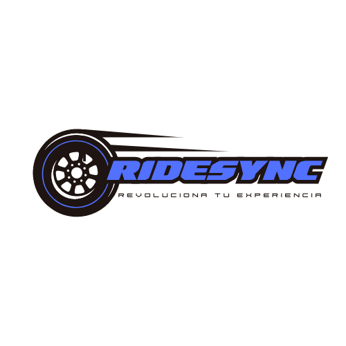

<!-- PROJECT LOGO -->
 

  

  <h3 align="center">RideSync</h3>

  

    Social network application for bikers
     
  

<!-- ABOUT THE PROJECT -->

## About the Project

With my experience in the motorcycle world, I have observed a gap: the lack of an
application dedicated exclusively to the motorcycling community. This gap has
inspired me to develop a platform aimed at forming groups within the community
and organizing motorcycling-related events. The proposed application aims to
provide a centralized space where motorcycle enthusiasts can connect,
communicate with their peers, share experiences, coordinate rides, and
strengthen the motorcycling community. This initiative seeks to help motorcyclists
get to know each other better and create a more united and participative
community.

### Built with

### Technologies

### Firebase

